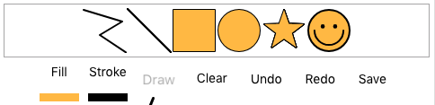
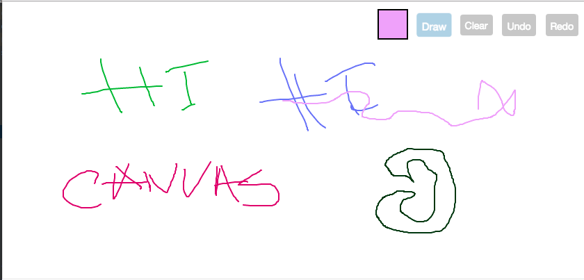
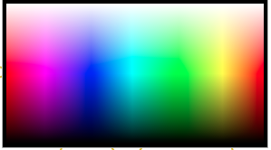

# ng2-canvas-whiteboard

## Canvas version changes
#### v4.0.2 merges PR to add variables for fillColorPickerText and strokeColorPickerText
https://github.com/webfactorymk/ng2-canvas-whiteboard/pull/68

#### v3.1.3, v4.0.1
Exports all existing canvas shapes, so that they can be easily unregistered from the canvas. (see README for unregistering the shapes).

Also, this version introduces two new Inputs,  `strokeColorPickerEnabled: boolean` and `fillColorPickerEnabled: boolean`, also deprecates the `colorPickerEnabled` Input.

For the sake of reverse-compat, the `colorPickerEnabled` input is still there and it will be used in combination with the two new variables. (ex: `colorPickerEnabled || fillColorPickerEnabled`). 

#### v3.1.1 Audits the npm packages and upgrades the lodash version from 4.17.11 to 4.17.13

#### v3.1.0 Merges the pull request from https://github.com/webfactorymk/ng2-canvas-whiteboard/pull/55 to allow the component to be used in Angular 8 and 9 applications. Also fixes the imports for rxjs items from 'rxjs/index' to 'rxjs'

#### v3.0.4 Fixes a bug with production build and recognition of shape names by adding an abstract method in the base Shape class.

#### v3.0.0 Removes the `rxjs-compat` library and adds `rxjs^6`. This means that older versions will not be supported if they upgrade to `ng2-canvas-whiteboard^3.0.0`.
#### *This version also changes the way of how this library is built and made ready for publish.*

#### For applications before Angular 6 please use versions below v3.0.0.

**Features:**<br/>
- Premade Shapes
- The ability to create custom premade shapes
- Supports touch.
- Supports UNDO/REDO.
- Implements a color picker for stroke and fill colors.
- Sends outputs on every action.
- Contains inputs for multiple modifications.
- Save drawn images

# Install

1. Install npm module:

    ```bash
    npm install ng2-canvas-whiteboard --save
    ```
    
2. If you are using system.js you may want to add this into `map` and `package` config:

    ```json
    {
        "map": {
            "ng2-canvas-whiteboard": "node_modules/ng2-canvas-whiteboard"
        },
        "packages": {
            "ng2-canvas-whiteboard": { "main": "index.js", "defaultExtension": "js" }
        }
    }
    ```
    
Add the module to your project

```typescript
@NgModule({
    imports: [
        CanvasWhiteboardModule
    ]
    ...
)}
```

In your component, you should add the CanvasWhiteboardComponent as a view provider
```typescript
@Component({
    selector: '...',
    viewProviders: [CanvasWhiteboardComponent],
    templateUrl: '...'
})
```

In the html file, you can insert the Canvas Whiteboard

```html
<canvas-whiteboard #canvasWhiteboard
                     [drawButtonClass]="'drawButtonClass'"
                     [drawButtonText]="'Draw'"
                     [clearButtonClass]="'clearButtonClass'"
                     [clearButtonText]="'Clear'"
                     [undoButtonText]="'Undo'"
                     [undoButtonEnabled]="true"
                     [redoButtonText]="'Redo'"
                     [redoButtonEnabled]="true"
                     [colorPickerEnabled]="true"
                     [fillColorPickerText]="'Fill'"
                     [strokeColorPickerText]="'Stroke'"
                     [saveDataButtonEnabled]="true"
                     [saveDataButtonText]="'Save'"
                     [lineWidth]="5"
                     [strokeColor]="'rgb(0,0,0)'"
                     [shouldDownloadDrawing]="true"
                     (onBatchUpdate)="sendBatchUpdate($event)"
                     (onClear)="onCanvasClear()"
                     (onUndo)="onCanvasUndo($event)"
                     (onRedo)="onCanvasRedo($event)">
</canvas-whiteboard>
```

If there is too much overhead with inputs, you can just specify the [options] input, and specify the options from the typescript code

Example:
```html
<canvas-whiteboard #canvasWhiteboard
                   [options]="canvasOptions"
                   (onBatchUpdate)="onCanvasDraw($event)"
                   (onClear)="onCanvasClear()"
                   (onUndo)="onCanvasUndo($event)"
                   (onRedo)="onCanvasRedo($event)">
</canvas-whiteboard>
```
Code:
```typescript
  canvasOptions: CanvasWhiteboardOptions = {
    drawButtonEnabled: true,
    drawButtonClass: "drawButtonClass",
    drawButtonText: "Draw",
    clearButtonEnabled: true,
    clearButtonClass: "clearButtonClass",
    clearButtonText: "Clear",
    undoButtonText: "Undo",
    undoButtonEnabled: true,
    redoButtonText: "Redo",
    redoButtonEnabled: true,
    colorPickerEnabled: true,
    fillColorPickerText: "Fill",
    strokeColorPickerText: "Stroke",
    saveDataButtonEnabled: true,
    saveDataButtonText: "Save",
    lineWidth: 5,
    strokeColor: "rgb(0,0,0)",
    shouldDownloadDrawing: true
  };
```


# Drawing on the canvas

The canvas drawing is triggered when the user touches the canvas, draws (moves the mouse or finger) and then stops drawing.
When the drawing is started, after 100 ms all the signals in between are added to a list and are sent as a batch signal which is 
emitted by the **onBatchUpdate** emitter. If received, the user can then manipulate with the sent signals.

# Inputs
##### `batchUpdateTimeoutDuration: number` (default: 100)
The time in milliseconds that a batch update should be sent after drawing.

##### `imageUrl: string` (optional)
The path to the image. If not specified, the drawings will be placed on the background color of the canvas.
This path can either be a base64 string or an actual path to a resource

##### `aspectRatio: number` (optional)
If specified, the canvas will be resized according to this ratio

##### `drawButtonClass: string`<br/>`clearButtonClass: string` <br/>`undoButtonClass: string` <br/>`redoButtonClass: string`<br/>`saveDataButtonClass: string`
The classes of the draw, clear, undo and redo buttons. These classes are used in "\<i>" tags. <br/>
Example:  
```html
[drawButtonClass]="'fa fa-pencil fa-2x'"
[clearButtonClass]="'fa fa-eraser fa-2x canvas_whiteboard_button-clear'"
   ```
##### `drawButtonEnabled: boolean` (default: true) <br/>`clearButtonEnabled: boolean` (default: true) <br/>`undoButtonEnabled: boolean` (default: false)<br/>`redoButtonEnabled: boolean` (default: false)<br/>`saveDataButtonEnabled: boolean` (default: false)
Specifies whether or not the button for drawing or clearing the canvas should be shown.

##### `drawButtonText, clearButtonText, undoButtonText, redoButtonText, saveDataButtonText`
Specify the text to add to the buttons, default is no text
```html
[drawButtonText]="'Draw'"
[clearButtonText]="'Clear'"
```

##Use the options: CanvasWhiteboardOptions to send the inputs
Changes to this object will be detected by the canvas in the OnChange listener and will be changed accordingly
```typescript
  //Component
  canvasOptions: CanvasWhiteboardOptions = {
      drawButtonEnabled: true,
      drawButtonClass: 'drawButtonClass',
      drawButtonText: 'Draw',
      clearButtonEnabled: true,
      clearButtonClass: 'clearButtonClass',
      clearButtonText: 'Clear',
      undoButtonText: 'Undo',
      undoButtonEnabled: true,
      redoButtonText: 'Redo',
      redoButtonEnabled: true,
      colorPickerEnabled: true,
      saveDataButtonEnabled: true,
      saveDataButtonText: 'Save',
      lineWidth: 4,
      scaleFactor: 1
  };

   //View
  <canvas-whiteboard #canvasWhiteboard
                       [options]="canvasOptions"
                       (onBatchUpdate)="onCanvasDraw($event)"
                       (onClear)="onCanvasClear()"
                       (onUndo)="onCanvasUndo($event)"
                       (onRedo)="onCanvasRedo($event)"
                       (onSave)="onCanvasSave($event)">
  </canvas-whiteboard>
```

NOTE: In order for the changeDetection to pick up the options changes, you must change the options reference whenever you want to change a value.
Example:
```typescript
  public changeOptions(): void {
    this.canvasOptions = {
      ...this.canvasOptions,
      fillColorPickerEnabled: true,
      colorPickerEnabled: false
    };
  }
```

### To add text to the buttons via css
Each button has its on class (example: Draw button -> .canvas_whiteboard_button-draw)<br/>
This button can be customized by overriding its css
```css
.canvas_whiteboard_button-draw:before {
  content: "Draw";
}
```
will add the "Draw" text to the button.

If using component-only styles, for this to work the viewEncapsulation must be set to None.
```typescript
@Component({
  selector: 'app-root',
  templateUrl: './app.component.html',
  styleUrls: ['./app.component.css'],
  encapsulation: ViewEncapsulation.None
})
```

You can also use the `::ng-deep` selector if you do not want to change the ViewEncapsulation property on the component.

##### Deprecated: `colorPickerEnabled: boolean` (default: false)
This allows the adding of a colorPickers that the user can choose to draw with (stroke and fill color),
and the original colors will be used when redrawing

##### `fillColorPickerEnabled: boolean` (default: false)
This shows/hides the fill color picker. Note: if this field has been to `false`, but the `colorPickerEnabled` field has been to `true`, the color picker will be shown, as per reverse-compat needs.

##### `fillColorPickerText: string` (default: 'Fill')
Specify the text to add to the fill color picker button. Default is 'Fill' for reverse-compat needs. 

##### `strokeColorPickerEnabled: boolean` (default: false)
This shows/hides the stroke color picker. Note: if this field has been to `false`, but the `colorPickerEnabled` field has been set to `true`, the color picker will be shown, as per reverse-compat needs.

##### `strokeColorPickerText: string` (default: 'Stroke')
Specify the text to add to the stroke color picker button. Default is 'Stroke' for reverse-compat needs.

##### `lineWidth: number` (default: 2)
This input controls the drawing pencil size

##### `strokeColor: string` (default: "rgba(0, 0, 0, 1)")
This input control the color of the brush

##### `fillColor: string` (default: "rgba(0, 0, 0, 0) -> transparent")
This input control the background color of the shapes

##### `shouldDownloadDrawing: boolean` (default: true)
This input control if the image created when clicking the save button should be downloaded right away.

##### `startingColor: string` (default: "#fff")
This input control is used to fill the canvas with the specified color at initialization and on resize events.

##### `scaleFactor: number` (default: 0)
This input controls the generation of the X and Y coordinates with a given scaleOffset. If not provided, the current with and height of the bounding rect and the canvas object will be used so that it works when transforming the canvas with css.

##### `drawingEnabled: boolean` (default: false)
This input controls if the drawing should be enabled from the start, instead of waiting for the user to click draw

##### `showStrokeColorPicker: boolean` (default: false)
This input controls if the CanvasWhiteboardColorPickerComponent for the `strokeColor` should be shown programmatically

##### `showFillColorPicker: boolean` (default: false)
This input controls if the CanvasWhiteboardColorPickerComponent for the `fillColor` should be shown programmatically

##### `downloadedFileName: string` (no default value)
This input controls the name of the file that will be downloaded when an image is saved.
If the `downloadCanvasImage` method is called with a `fileName` as a third parameter, then it will have priority over everything
If the `fileName` is not provided, then this Input will have priority. If this input is not provided as well,
the image will be saved as `canvas_drawing_" + new Date().valueOf()`;
At the end the file extension will be added so that it can be opened by a particular app.

##### `lineJoin: string` (default: "round")
The lineJoin property sets or returns the type of corner created, when two lines meet.

##### `lineCap: string` (default: "round")
The lineCap property sets or returns the style of the end caps for a line.

##### `shapeSelectorEnabled: boolean` (default: true)
This input controls if the CanvasWhiteboardShapeSelectorComponent will be enabled so that the user can pick other shapes via the View

##### `showShapeSelector: boolean` (default: false)
This input controls if the CanvasWhiteboardShapeSelectorComponent should be shown programmatically

## Event emitters
```typescript
 @Output() onClear = new EventEmitter<any>();
 @Output() onBatchUpdate = new EventEmitter<CanvasWhiteboardUpdate[]>();
 @Output() onImageLoaded = new EventEmitter<any>();
 @Output() onUndo = new EventEmitter<any>();
 @Output() onRedo = new EventEmitter<any>();
 @Output() onSave = new EventEmitter<string | Blob>();
```
**`onClear`** is emitted when the canvas has been cleared. <br/>
**`onImageLoaded`** is emitted if the user specified an image and it has successfully been drawn on the canvas.
**`onUndo`** is emitted when the canvas has done an UNDO function, emits an UUID (string) for the continuous last drawn shape undone. <br/>
**`onClear`** is emitted when the canvas has done a REDO function, emits an UUID (string) for the continuous shape redrawn. <br/>
**`onSave`** is emitted when the canvas has done a SAVE function, emits a Data URL or a Blob (IE). <br/>

# Canvas Whiteboard Shapes
Every shape in the application extends the ```abstract class CanvasWhiteboardShape```. This class adds predefined methods so that
the creator of the shape can follow them and decide how his shape should be drawn.

Each shape is made of a starting position point of type ```CanvasWhiteboardPoint```, and an options object
which may be different for each shape, and it's of type ```CanvasWhiteboardShapeOptions```.

Each predefined shape must know how to:
- Return the name of the shape (should be the same as the name of the class)
- Draw itself given a canvas context
- Draw it's preview given a canvas context
- Update itself given a ```CanvasWhiteboardUpdate```

All of the predefined shapes are registered and available in the CanvasWhiteboardShapeService which the user can have to register/unregister additional shapes.

To create a new shape, you must create a class which extends the ```abstract class CanvasWhiteboardShape``` .

From there you need to implement the required methods.

After all of this is complete, you need to register this shape in the canvas whiteboard shape service (for the sake of convention).

```typescript
class AppComponent {
     constructor(private _canvasWhiteboardService: CanvasWhiteboardService, private _canvasWhiteboardShapeService: CanvasWhiteboardShapeService) {
            _canvasWhiteboardShapeService.registerShape(RandomShape);
     }
}

export class RandomShape extends CanvasWhiteboardShape {
    linePositions: Array<number>;

    constructor(positionPoint?: CanvasWhiteboardPoint, options?: CanvasWhiteboardShapeOptions) {
        // Optional constructor if you need some additional setup
        super(positionPoint, options);
        this.linePositions = [];
    }

    getShapeName(): string {
        // Abstract method which should return a string with the shape name
        // Should be the same as the class name
        return 'RandomShape';
    }

    draw(context: CanvasRenderingContext2D): any {
        // Tell the canvas how to draw your shape here

        // Use the selected options from the canvas whiteboard
        // Object.assign(context, this.options);

        // Start drawing
        // context.save();
        // context.beginPath();
        // context.stroke();
        // context.fill();
        // context.closePath();
        // context.restore();
    }

    drawPreview(context: CanvasRenderingContext2D): any {
        // Provide info or update this object when it's needed for preview drawing.
        // Example: The CIRCLE selects the center point and updates the radius.
        // Example: The RECT selects 0,0 and updates width and height to 100%.

        // Then call the draw method with the updated object if you want your shape
        // to have a proper preview.

        // this.draw(context);
    }

    onUpdateReceived(update: CanvasWhiteboardUpdate): any {
        // Choose what your shape does when an update is registered for it
        // For example the CircleShape updates it's radius
    }

    onStopReceived(update: CanvasWhiteboardUpdate): void {
        // This method is optional but CAN be overriden
    }
}
 ```

## Unregistering Shapes

The default shapes can also be unregistered. Example:
```typescript
@Component({
  selector: 'app-root',
  templateUrl: './app.component.html',
  styleUrls: ['./app.component.css']
})
export class AppComponent {
  constructor(private canvasWhiteboardShapeService: CanvasWhiteboardShapeService) {
    this.canvasWhiteboardShapeService.unregisterShapes([CircleShape, SmileyShape, StarShape]);
  }
}
```

NOTE: There must be at least one shape registered for the canvas to work, but for the sake of convenience, all of the default shapes have been exported (maybe someone would want to unregister all of them and register his own shapes), but it is recommended not to unregister the FreeHandShape.

# Canvas Whiteboard Shape Selector
The `CanvasWhiteboardComponent` is now equipped with a shape selector (since the free hand drawing is now a shape because of consistency),
The shape selector can be managed or hidden with inputs, and it basically calls the `CanvasWhiteboardShapeService` and draws all the
registered shapes so that they can be selected. They are drawn with the selected fill/stroke color for preview.



# Canvas Whiteboard Service
The ```CanvasWhiteboardService``` will be used by the canvas to listen to outside events.
The event emitters and ViewChild functionality will remain the same but with this service 
we can notify the canvas when it should invoke a specific action

Example:
```typescript
export class AppComponent {
  constructor(private _canvasWhiteboardService: CanvasWhiteboardService) {}
 
  public receiveNewMessage(newMessage: any): void {
     switch (newMessage.type) {
       case VCDataMessageType.canvas_draw:
         let updates = newMessage.data.map(updateJSON => CanvasWhiteboardUpdate.deserializeJson(JSON.parse(updateJSON)));
         this._canvasWhiteboardService.drawCanvas(updates);
         break;
       case VCDataMessageType.canvas_clear:
         this._canvasWhiteboardService.clearCanvas();
         break;
       case VCDataMessageType.canvas_undo:
         this._canvasWhiteboardService.undoCanvas(newMessage.UUID);
         break;
       case VCDataMessageType.canvas_redo:
         this._canvasWhiteboardService.redoCanvas(newMessage.UUID);
         break;
     }
  }
}   
```
### Requesting the full update history so far
Can be called via the method  `getDrawingHistory(): CanvasWhiteboardUpdate[]`. The items will be deep cloned for consistency using lodash.

## Saving drawn canvas as an image
In order to save drawn images you can either click the Save button in the canvas, 
use the short Ctrl/Command + s key or get a reference of the canvas and save programmatically.

Example, save an image whenever an undo action was made:

HTML: Create a canvas view reference with some name (ex: #canvasWhiteboard)
```html
<canvas-whiteboard #canvasWhiteboard>
</canvas-whiteboard>
```
```typescript
import {CanvasWhiteboardComponent} from 'ng2-canvas-whiteboard';

export class AppComponent {

  @ViewChild('canvasWhiteboard') canvasWhiteboard: CanvasWhiteboardComponent;

  onCanvasUndo(updateUUID: string) {
    console.log(`UNDO with uuid: ${updateUUID}`);
    
    //Returns base64 string representation of the canvas
    let generatedString = this.canvasWhiteboard.generateCanvasDataUrl("image/jpeg", 0.3);
     
    //Generates a IE canvas blob using a callbak method
    this.canvasWhiteboard.generateCanvasBlob((blob: any) => {
       console.log(blob);
    }, "image/png");
    
    //This method uses both of the above method and returns either string or blob
    //using a callback method
    this.canvasWhiteboard.generateCanvasData((generatedData: string | Blob) => {
        console.log(generatedData);
    }, "image/png", 1);
    
    //This method downloads the image using either existing data if it exists
    //or creates it locally
    this.canvasWhiteboard.downloadCanvasImage("image/png", existingData?, "customFileName");
    
    //If you need the context of the canvas
    let context = this.canvasWhiteboard.context;
  }
}

```
## Image of canvas


## Canvas whiteboard color picker (CanvasWhiteboardColorPickerComponent)
A canvas component that is used to identify and emit selected colors.
```typescript
@Input() selectedColor: string (default: "rgb(0,0,0)");
```
```typescript
@Output() onColorSelected = new EventEmitter<string>();
```

 

# Example of a drawn image
An example of a drawn image and shape on the canvas with additional css for the buttons and a date:


# Example of a full fledged WebRTC app which shares drawing signals


## Current limitations

- If there are problems with the sizing of the parent container, the canvas size will not be the wanted size.
It may sometimes be width: 0, height: 0.
If this is the case you may want to call a resize event for the window for the size to be recalculated.
```typescript
    if (this.isCanvasOpened) {
      setTimeout(() => {
        window.dispatchEvent(new Event('resize'));
      }, 1);
    }
```
